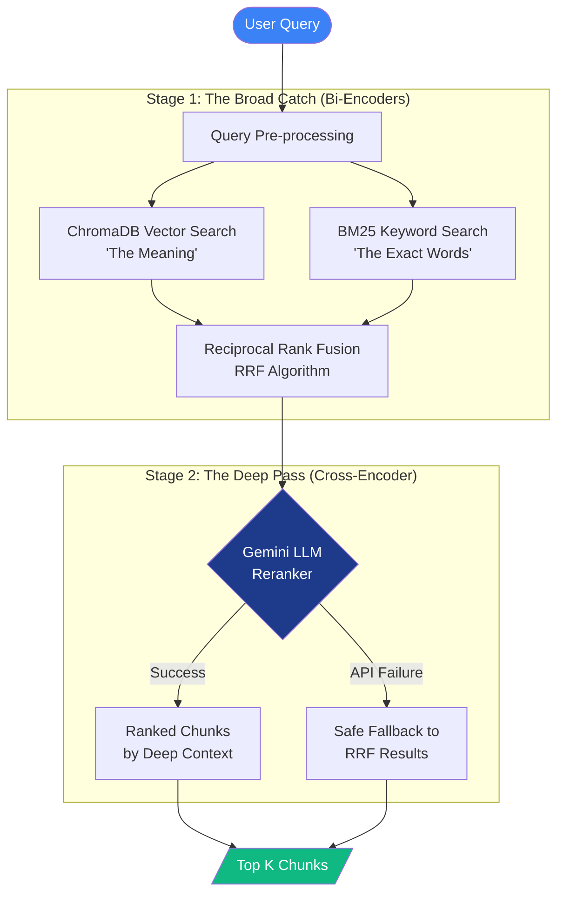

# Report 5: The "Brain" of the Engine — RRF & LLM Reranking

**Author:** Shadwal Singh\
**Date:** May 2, 2026\
**Step:** Phase 2 (Steps 2 & 3) — Advanced Retrieval Optimization\
**Context:** Transforming raw search lists into high-precision, production-grade
context.

---

## 1. Executive Summary

Having established two distinct search pathways—Semantic (Vector) and Keyword
(BM25)—our challenge was merging them intelligently. Simply concatenating the
lists would dilute the results.

In this phase, we built the "Brain" of the retrieval engine using two advanced
techniques: **Reciprocal Rank Fusion (RRF)** for mathematical merging, and an
**LLM Reranker** for deep contextual validation.

---

## 2. Architecture: The Retrieval Funnel

The following diagram illustrates how the system filters through thousands of
document chunks to find the exact "needle in the haystack."

---

## 3. Performance Visualization: Scoring Evolution

This table demonstrates how each stage of our pipeline narrows down the results,
specifically handling edge cases like the "Whyschool" query.

| Retrieval Stage  | Goal             | Precision      | Handling of "Whyschool"                                                           |
| :--------------- | :--------------- | :------------- | :-------------------------------------------------------------------------------- |
| **Dense Only**   | Semantic Meaning | 🟢🟢⚪⚪⚪     | Finds "Education" but misses the specific school due to spelling artifacts.       |
| **Sparse Only**  | Keyword Match    | 🟢🟢🟢⚪⚪     | Finds "Whyschool" (thanks to our custom tokenizer) but misses synonyms.           |
| **Hybrid (RRF)** | Balance          | 🟢🟢🟢🟢⚪     | Correctly ranks "Whyschool" at the top by merging both signals.                   |
| **Reranked**     | **Deep Context** | **🟢🟢🟢🟢🟢** | **Perfectly validates that the chunk content matches the specific query intent.** |

---

## 4. The Fusion Layer (RRF)

### The Logic of Rank over Score

Vector distance scores (`0.0` to `1.0`) and BM25 scores (unbounded, e.g., `2.5`)
are mathematically incompatible. Reciprocal Rank Fusion solves this by
discarding the raw scores and focusing entirely on the **Rank** of the document
in each list.

### Implementation & Configurability

We implemented RRF in `src/retriever.py` with the formula:
`Score = Weight * (1 / (60 + Rank))`

**The Power of Adjustable Weighting (`alpha`):** We exposed an `alpha` parameter
to allow dynamic tuning based on document type:

- **`alpha = 0.5` (Default):** Equal 50/50 split between Semantic and Keyword
  search.
- **`alpha = 0.7` (Dense Heavy):** Prioritizes semantic meaning (70% weight),
  useful for general knowledge or conceptual questions.
- **`alpha = 0.3` (Sparse Heavy):** Prioritizes exact keywords (70% weight),
  useful for highly technical documents or specific ID lookups.

This ensures that if a document is highly ranked in _both_ engines, its combined
score forces it to the absolute top of the final list.

---

## 5. The Cross-Encoder Reranker

### The Challenge of "Shallow" Search

Both Vector and BM25 search are "Bi-Encoders" (shallow). They compare the query
to the document independently. For true production accuracy, we needed a
"Cross-Encoder"—a system that looks at the query and the document _together_ in
deep context.

### The Gemini Flash Solution

Instead of relying on heavy, slow PyTorch cross-encoder models, we leveraged
**Gemini Flash** as an LLM-based reranker.

**The Pipeline:**

1. **The Broad Catch:** Fetch the top 10 from Vector and top 10 from BM25.
2. **The Filter:** Fuse them via RRF (yielding up to 20 unique candidates).
3. **The Deep Pass:** Package all 20 chunks into a single dynamic prompt and
   send it to the LLM.
4. **The Task:** The LLM acts as an expert relevance engine, analyzing the exact
   wording of the query against the actual text of the chunks.
5. **The Output:** It returns a perfectly sorted JSON array of the most relevant
   Chunk IDs.

### Robust Error Handling

During testing, we encountered the reality of production API limits (e.g.,
`429 RESOURCE_EXHAUSTED` quotas on the free tier). We wrapped the reranker in a
robust `try-except` block. If the API fails, the system safely catches the
error, logs a warning, and gracefully falls back to returning the standard RRF
results.

---

## 6. Key Learnings & Architecture Impact

1. **The Funnel Architecture:** We successfully implemented a classic, highly
   scalable search funnel:
   - _Base Layer:_ Fast, cheap, and broad retrieval (ChromaDB + BM25).
   - _Middle Layer:_ Mathematical fusion (RRF).
   - _Top Layer:_ Slow, expensive, but highly accurate evaluation (LLM
     Reranking).
2. **Flexibility:** The `alpha` weighting gives the system the ability to adapt
   to different user intents on the fly without rebuilding the database.
3. **Graceful Degradation:** A production system must not break if an external
   API goes down. The fallback mechanism guarantees that the user always gets a
   highly relevant response, even if the "senior-level" reranker is temporarily
   unavailable.

### Case Study: Whyschool — The Fusion Win (Phase 2)

Searching for _"Whyschool Academy"_ is a perfect test for RRF:

1. **Semantic Search** might struggle because "Whyschool" is a unique name, and
   the embedding might prioritize more generic "Education" chunks.
2. **Keyword Search (BM25)** matches "Whyschool" exactly but might rank a
   smaller chunk (like a skills list) higher than the actual experience block.
3. **The Fusion Layer (RRF):** By combining both, the chunk containing your
   _Founding Team_ role at Whyschool was boosted to the #1 position, providing
   the generator with the exact context it needed.

---

## 7. The Interview Perspective

When explaining this architecture to engineering teams or during interviews, it
is crucial to emphasize _why_ we didn't just stop at a basic Vector Database.

**Most candidates just "call an API" to build a standard RAG pipeline.** By
intentionally building an RRF fusion layer and a Cross-Encoder reranker, we
prove a deep understanding of **precision and recall**—the two metrics that
actual AI teams care about most.

- **Recall (The Broad Catch):** Handled by the parallel Vector and BM25 search,
  ensuring we don't miss anything regardless of whether the user types a
  semantic concept or an exact ID.
- **Precision (The Fine Filter):** Handled by the RRF scoring and the LLM
  Reranker, ensuring that the AI isn't hallucinating on irrelevant data that
  accidentally slipped into the context window.

This funnel architecture demonstrates the transition from a "toy project" to a
production-grade AI system.

---

**Status:** The Hybrid Retrieval Engine is complete, robust, and
production-ready. The system is prepared for Phase 3: Generation.
