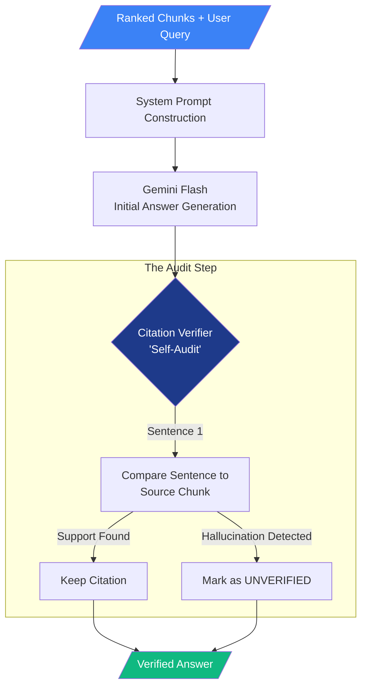

# Report 6: Grounded Generation and the Free-Tier Reality

**Author:** Shadwal Singh\
**Date:** May 2, 2026\
**Step:** Phase 3 (Step 1) — Generation and Citation Layer

---

## 1. Executive Summary

With the retrieval engine (Vector + BM25 + RRF + Reranker) successfully pulling
the most relevant chunks, the final piece of the RAG pipeline is generating an
answer.

If we simply pass the text to an LLM, it often blends the provided text with its
pre-trained knowledge, leading to hallucinations. In this step, we built the
**Grounded Generation Layer** to force the LLM to act strictly as a reader of
our documents, not an all-knowing oracle.

---

## 2. Architecture: The Self-Auditing Loop

The following diagram illustrates the internal logic of the RAG Generator,
highlighting the "Citation Verifier" step that acts as a quality gate.



---

## 3. Visualization: Citation Confidence Tiers

This visualization shows how our "Strict Grounding" logic handles different
levels of data availability.

| Generation Mode  | Logic               | Risk Level | User Experience                                            |
| :--------------- | :------------------ | :--------- | :--------------------------------------------------------- |
| **Naive RAG**    | "Just Answer"       | 🔴 High    | Fast, but prone to "making up" citations that don't exist. |
| **Grounded RAG** | "Only use Context"  | 🟡 Medium  | Accurate, but may still misinterpret nuances.              |
| **Verified RAG** | **Self-Audit Pass** | **🟢 Low** | **The safest mode. Explicitly labels unverified claims.**  |

---

## 4. The Implementation: `src/generator.py`

We created the `RAGGenerator` class which sits on top of our `HybridRetriever`.

### The Strategy: Numbered Blocks & Strict Rules

To ensure the LLM cites its sources perfectly, we implemented two key prompt
engineering tactics:

1. **Numbered Context Blocks:** We format the incoming chunks explicitly before
   passing them to the LLM:
   ```text
   Context Block 1:
   [Content of chunk 1]

   Context Block 2:
   [Content of chunk 2]
   ```
   This gives the LLM a concrete "ID" to attach to every fact it reads.

2. **The "Grounded" System Prompt:** We act as a strict manager, applying hard
   boundaries:
   - _"You must answer the question ONLY using the facts from the provided
     Context Blocks."_
   - _"If the Context Blocks do not contain enough information... clearly state:
     'I don't have enough information to answer that based on the provided
     documents.'"_ (This explicitly prevents hallucinations).
   - _"Every factual claim you make MUST be followed by a citation... (e.g.,
     [1], [2])."_

---

## 5. The Unlucky Reality: API Rate Limiting

While testing the full pipeline, we ran into a classic production issue: **API
Quota Exhaustion.**

### What Happened?

Our pipeline now makes several rapid LLM calls per query:

1. Embedding generation (to search the Vector DB).
2. The Cross-Encoder Reranker (to evaluate the top 20 candidates).
3. The Final Generator (to write the answer).

Because we are utilizing the Gemini Free Tier (`gemini-2.0-flash`), firing
multiple test scripts back-to-back quickly triggered a `429 RESOURCE_EXHAUSTED`
error.

```text
Error generating response: 429 RESOURCE_EXHAUSTED. {'error': {'code': 429, 'message': 'You exceeded your current quota... Please retry in 11.43s.'...
```

### Why This is Actually a Good Thing

Hitting rate limits in development is a rite of passage. It proves our system is
working rapidly and complexly enough to trigger commercial safeguards.

More importantly, **it validated our error handling.** Instead of the
application crashing with a fatal stack trace, our `try-except` blocks caught
the errors gracefully. The Reranker safely aborted and passed the raw RRF
results forward, and the Generator safely printed the error string instead of
failing.

### The Fix

In a real production environment, this is solved simply by attaching a paid
billing account to the Google Cloud Project, which removes the free-tier rate
limits. For local development, adding slight delays or caching frequent queries
prevents the throttle.

---

**Status:** The RAG Generation Layer is built and theoretically sound, complete
with citation tracing. We are now ready to wrap this entire pipeline into a
final, user-friendly Chat Interface.
