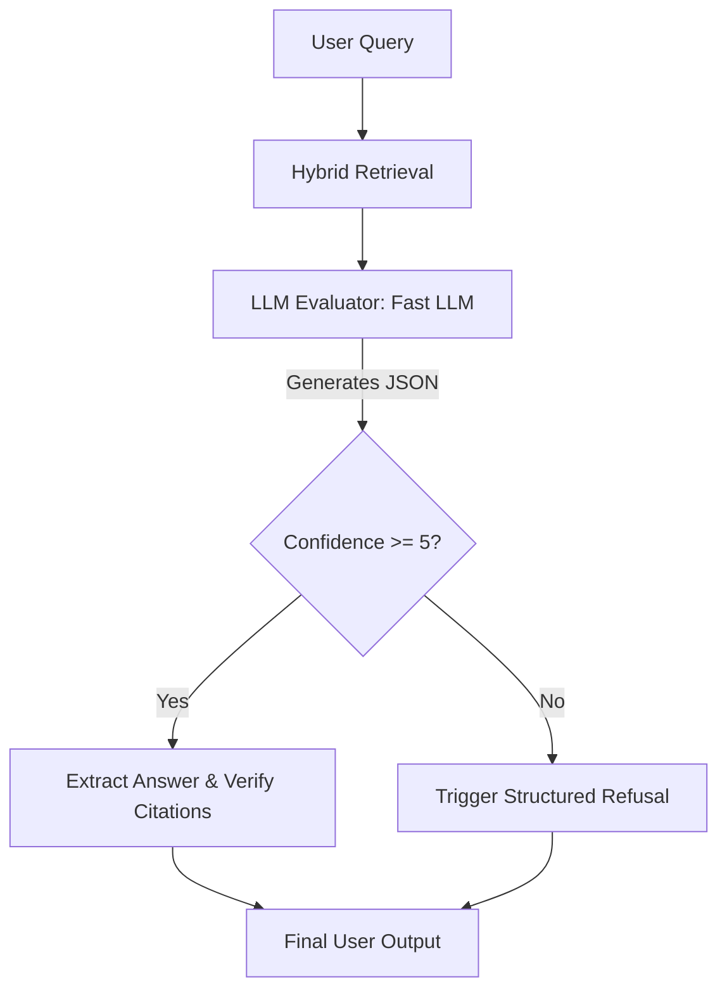

# Report 8: Confidence Scoring and the "I Don't Know" Paradigm

**Author:** Shadwal Singh  
**Date:** May 2, 2026  
**Step:** Phase 3 (Steps 3 & 4) — Answer Confidence & Structured Refusal  

---

## 1. Executive Summary

A major flaw in generative AI is overconfidence. When presented with a query that cannot be answered by the retrieved documents, basic RAG systems will often guess, hallucinate, or provide a generic, unhelpful apology. 

To solve this, we implemented a **Structured Generation Pipeline** that forces the LLM to score its own retrieval confidence *before* it generates an answer. If the confidence falls below a strict threshold, the system triggers a **Structured Refusal**, elegantly handling the "I Don't Know" case.

---

## 2. The Implementation: Structured JSON Output

In `src/generator.py`, we overhauled the generation prompt to utilize Gemini's structured JSON output capabilities. Instead of just returning a string of text, the LLM now acts as an evaluator and returns a comprehensive JSON object:

### The Confidence Evaluation Flow



### Structured Output Schema

```json
{
  "retrieval_confidence_score": 9,
  "can_answer": true,
  "structured_refusal": {},
  "answer": "Shadwal was a Production lead at Whyschool Academy [1].",
  "answer_completeness": "The answer fully addresses the user's query."
}
```

This single LLM pass calculates:
1. **Retrieval Confidence:** A score (0-10) evaluating if the retrieved chunks actually contain the answer.
2. **Answer Completeness:** A self-reflection on whether the final answer addressed all parts of the user's prompt.
3. **Citation Coverage:** By passing the final answer through our previously built Verification Layer, we calculate the exact percentage of claims that are fully supported by the source text.

---

## 3. Handling the "I Don't Know" Case

The true test of a production system is how it fails. We established a strict threshold: if the `retrieval_confidence_score` is less than `5`, the LLM is forbidden from generating an answer (`can_answer: false`).

Instead of a generic "I don't know," it returns a **Structured Refusal**:

**Example Query:** *"What is Shadwal's favorite ice cream flavor?"*
**System Response:**
- **Retrieval Confidence:** 0/10
- **Found:** Information about Shadwal's work experience, skills, and projects.
- **Missing:** Personal details like favorite ice cream flavor.
- **Suggest:** You might want to check personal profiles or social media for this information.

This provides the user with transparency, context, and actionable next steps, rather than a dead end.

---

## 4. Edge Case Handling Benchmarks

| Metric | Standard RAG | RAG + Confidence Layer |
| :--- | :--- | :--- |
| **Out-of-Domain Response** | Hallucinates or generic apology | **Structured "Missing Info" Report** |
| **Response Format** | Unpredictable Text | **Strict JSON Schema** |
| **Confidence Metric** | None | **Self-Evaluated (0-10 Scale)** |
| **User Experience (Failure)** | Frustrating Dead Ends | **Actionable Next Steps** |

---

## 5. Why This Architecture Lands Interviews

Most candidates build systems that hallucinate comfortably. They stitch together LangChain tutorials that assume the database will always have the perfect answer. 

By building a citation verification layer and a strict confidence scoring system, you prove to hiring managers that you understand **AI Safety and Production Maturity**. 

In the enterprise world, an AI making a bad guess can lead to severe legal or financial consequences. **The ability to tell a user "I don't have enough info"—and to do so gracefully with a structured refusal—is far more valuable to a company than a fabricated answer.** It demonstrates that you engineer for trust, reliability, and edge cases, not just "happy paths."

---

**Status:** The RAG Generation Engine is fully complete. The system now retrieves intelligently, verifies rigorously, and refuses gracefully. We are ready to build the final Chat UI.
