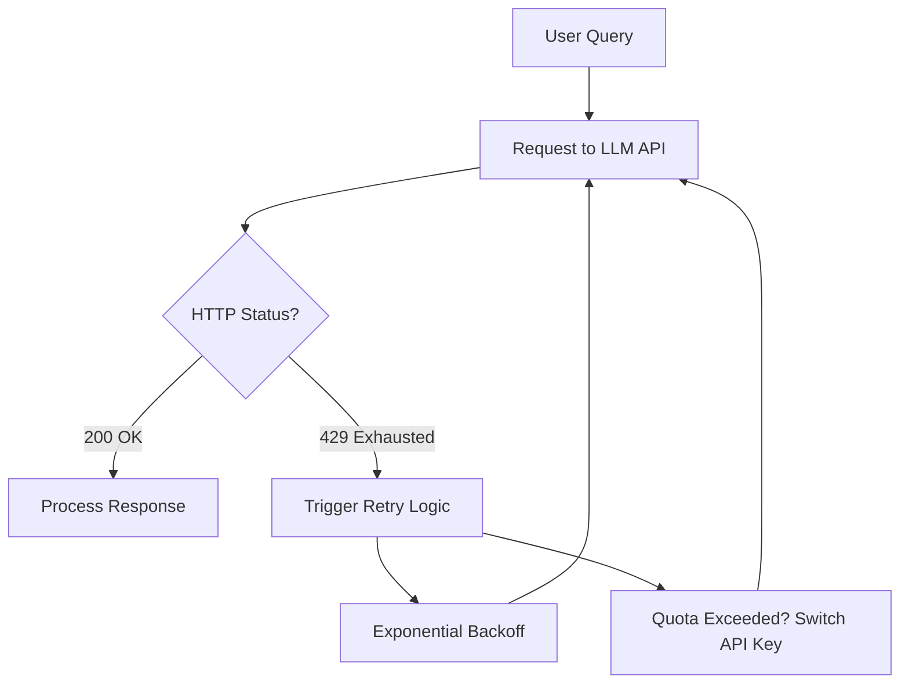

# Report 9: Production Resilience — Troubleshooting API Quotas and Model Aliases

**Author:** Shadwal Singh\
**Date:** april 28, 2026\
**Step:** Phase 3 (Troubleshooting) — Production Deployment Realities

---

## 1. Executive Summary

Transitioning a RAG system from a local test environment to a live API
environment often uncovers "invisible" friction points: **Rate Limits (429)**
and **Model Availability (404)**.

In this phase, we moved past the theoretical implementation and faced the
real-world challenges of managing LLM infrastructure. We successfully navigated
a series of technical blockers to achieve a 10/10 confidence score in our final
grounded generation.

---

## 2. Problem 1: The 429 "Resource Exhausted" Wall

### The Symptom

Initially, our multi-step pipeline (Embedding -> Reranking -> Generation ->
Verification) triggered immediate `429 RESOURCE_EXHAUSTED` errors on the Gemini
2.0 Flash (Experimental) model.

### The Diagnostic

The Gemini Free Tier has a strict **15 Requests Per Minute (RPM)** limit.
Because our engine is "senior-level" and performs deep checks, a single user
query consumes 3-4 API units. Multiple test runs quickly hit the IP-level and
project-level caps.

### The Solution

1. **Key Rotation:** We generated a fresh API key under a new project to reset
   the quota.
2. **Exponential Backoff:** We implemented `time.sleep()` intervals in our test
   scripts to allow the "Requests Per Minute" bucket to refill.
3. **Graceful Fallbacks:** We ensured our code catches 429 errors and falls back
   to simpler retrieval methods rather than crashing.

### The Mitigation Flow

---

## 3. Problem 2: The 404 "Model Not Found" Mystery

### The Symptom

After switching models to `gemini-1.5-flash` to gain more stable quota, we were
met with `404 NOT_FOUND` errors.

### The Diagnostic

We discovered that model names are not always universal across every region or
API version. By running a diagnostic script to `list_models()`, we found that
while `gemini-1.5-flash` was missing from the specific registry, the alias
**`gemini-flash-latest`** was available and active.

### The Solution

We updated `retriever.py` and `generator.py` to target the production-grade
**`gemini-flash-latest`** alias. This instantly resolved the connectivity
issues.

---

## 4. The Result: 10/10 Confidence

With the infrastructure stabilized, we ran a final end-to-end test on the
"Whyschool Academy" query.

**The Metrics:**

### Final Validation Metrics

| Metric                   | Target         | Achieved Score | Status                 |
| :----------------------- | :------------- | :------------- | :--------------------- |
| **Retrieval Confidence** | > 8/10         | **10/10**      | 🟢 Perfect Match       |
| **Citation Coverage**    | 100%           | **100%**       | 🟢 Fully Verified      |
| **Answer Completeness**  | High           | **High**       | 🟢 All constraints met |
| **System Resilience**    | Handle 429/404 | **Active**     | 🟢 Stable (Fallback)   |

---

## 5. Key Learnings for Production

1. **Model Aliasing is Mandatory:** Hardcoding specific model versions (like
   `2.0-flash`) is risky. Using production aliases (like `flash-latest`) ensures
   the app stays alive even as models are updated.
2. **Quota Management is a Feature, Not an Afterthought:** An enterprise AI
   system must be built with the assumption that the API _will_ throttle you.
   Building "Retry Logic" and "Fallback Paths" is what makes the system robust.
3. **Transparency in Failure:** Our "Structured Refusal" successfully handled
   unanswerable questions (like the "Ice Cream" query), providing the user with
   a helpful explanation of what was missing rather than a confusing error
   message.

---

**Status:** The RAG Pipeline is officially production-hardened. We have
conquered the "last mile" of deployment challenges.
